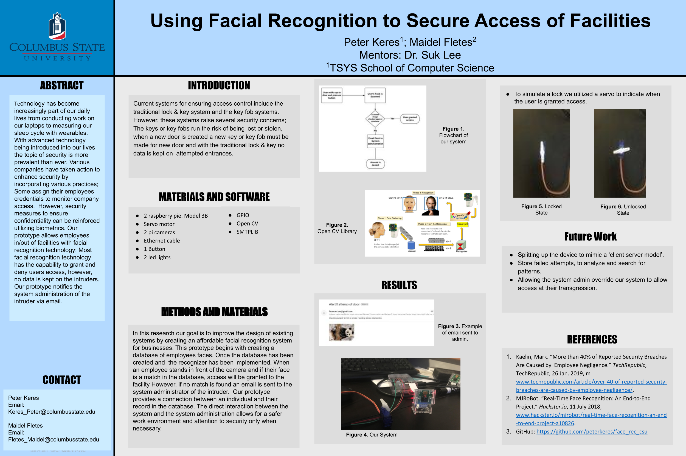

# Using facial recognition to secure access of facilities

This was the final in my 'computer architecture' class. The final was that we needed to create some type of system that used IoT devices along with sensors. 

Me and a partner deiced to do some type of facial recognition system that would allow users to enter doors.

### Pitch

Technology has become increasingly part of our daily lives from conducting work on our laptops to measuring our sleep cycle with wearables. With advanced technology being introduced into our lives the topic of security is more prevalent than ever. Various companies have taken action to enhance security by incorporating various practices; Some assign their employees credentials to monitor company access.  
However, security measures to ensure confidentiality can be reinforced utilizing biometrics. Our prototype allows employees in/out of facilities with facial recognition technology; Most facial recognition technology has the capability to grant and deny users access, however, no data is kept on the intruders. Our prototype notifies the system administration of the intruder via email, containing the intruders face and attempted access time. The prototype begins with creating a database of employees faces. Once the database has been created and  the recognizer has been implemented. When an employee stands in front of the camera and if their face is a match in the database, access will be granted to the facility However, if no match is found an email is sent to the system administrator of the intruder.  Our prototype provides a connection between an individual and their record in the database. The direct interaction between the system and the system administration allows for a safer work environment and attention to security only when necessary.

### Items Used

Here are both software and hardware items used in this project:

##### Hardware
- raspberry pie model 3b
- Servo motor
- Pi camera
- Ethernet cable
- 1 button
- 3 Led lights

##### Software/library
- python v3.8
- Opencv v3
- GPIO library
- Smtplib

### ACM Mid-Southeast Conference

This project was selected to be presented at the ACM Mid-Southeast Conference in 2019. During which we gave a presentation of our system along with a very early mock demo.

Our power-point can be found [here](resources/report.pptx)

### Resources used

A few resources we used during development:

- [Setting up buttons](https://projects.raspberrypi.org/en/projects/grandpa-scarer/4)
- [Setting up servo motor](https://www.electronicshub.org/raspberry-pi-servo-motor-interface-tutorial/)
- [Sending off email alerts](https://realpython.com/python-send-email/)
- [Using OpenCV](https://www.hackster.io/mjrobot/real-time-face-recognition-an-end-to-end-project-a10826)

### Current Project Status

Currently development on the project as stopped. Its possible that work might continue after graduation and finding a job, but its not guaranteed at this time. 

